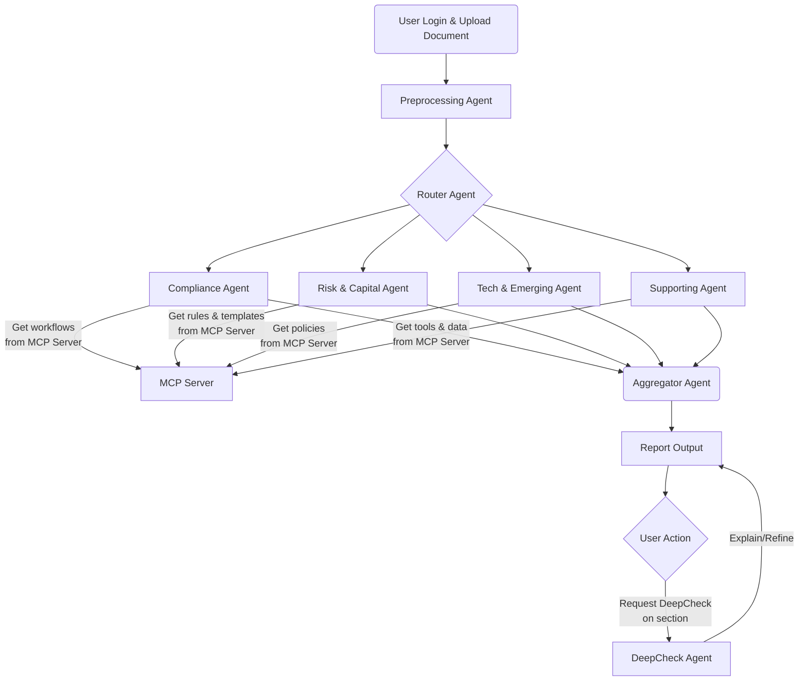

---

# 1. Danh sách các Agents 


## **1. Compliance Agent**

**Chức năng:**

* Tổng hợp toàn bộ các tác vụ kiểm tra tuân thủ pháp luật, phòng chống tội phạm tài chính và bảo vệ khách hàng.
* Bao gồm các domain như: AML/CTF (chống rửa tiền), KYC/CDD (xác minh khách hàng), Sanctions/Blacklist (đối chiếu danh sách cấm), Fraud Prevention (phòng chống gian lận), Consumer Protection (bảo vệ người tiêu dùng).
* Đảm bảo các giao dịch và khách hàng đều tuân thủ quy định hiện hành, giảm rủi ro pháp lý và tài chính.

---

## **2. Risk & Capital Agent**

**Chức năng:**

* Phụ trách đánh giá rủi ro tổng thể và tính toán, kiểm tra các chỉ số an toàn vốn, thanh khoản theo quy định Basel và pháp luật địa phương.
* Chăm sóc các lĩnh vực: Risk Management (quản trị rủi ro tín dụng, thị trường, hoạt động), Capital Adequacy (đủ vốn tối thiểu), Liquidity Management (quản trị thanh khoản), Regulatory Reporting (chuẩn bị báo cáo định kỳ gửi cơ quan quản lý).
* Bảo vệ sự an toàn, ổn định cho hệ thống tài chính của tổ chức.

---

## **3. Tech & Emerging Agent**

**Chức năng:**

* Giám sát, kiểm tra tuân thủ về công nghệ, dữ liệu và các quy định nổi bật, mới xuất hiện.
* Bao gồm: Cybersecurity Compliance (an ninh mạng), Data Privacy/Protection (bảo vệ dữ liệu cá nhân/GDPR), Third-Party Risk Management (quản lý rủi ro đối tác, bên thứ ba), ESG Compliance (môi trường, xã hội, quản trị công ty), Business Continuity (kế hoạch duy trì hoạt động liên tục).
* Đảm bảo hệ thống vận hành an toàn, minh bạch, thích ứng với các xu thế và quy định mới.

---

## **4. Supporting Agent**

**Chức năng:**

* Hỗ trợ toàn bộ quá trình automation và kiểm tra, cung cấp công cụ, dữ liệu, đường dẫn workflow cho các agent nghiệp vụ thực thi tác vụ.
* Có thể gồm: Preprocessing Agent (tiền xử lý dữ liệu, trích xuất thông tin), Router Agent (định tuyến bài toán đến agent phù hợp), Aggregator Agent (tổng hợp kết quả), Audit Trail Agent (ghi log, lưu vết), Knowledge Management Agent (quản lý quy trình, tài liệu nội bộ).
* Đóng vai trò nền tảng, không trực tiếp xử lý nghiệp vụ compliance nhưng giúp hệ thống vận hành hiệu quả, dễ audit, dễ maintain.


---

# 2. Prompt cho con Router


Bạn là **Aggregator/Router Agent** trong hệ thống kiểm tra tuân thủ tự động cho ngân hàng.

**Nhiệm vụ:**

* Nhận kết quả từ nhiều agent con, mỗi agent phụ trách một nhóm nghiệp vụ:
  1. **Compliance Agent** (gồm AML, KYC, Sanctions, Fraud, Consumer Protection...)
  2. **Risk & Capital Agent** (gồm Risk Management, Capital Adequacy, Regulatory Reporting...)
  3. **Tech & Emerging Agent** (gồm Cybersecurity, Data Privacy, Third-Party Risk, ESG Compliance, Business Continuity...)
* Mỗi agent con trả về kết quả dạng JSON:
  * `result` ("Passed"/"Failed")
  * `issue` (mô tả vấn đề nếu có)
  * `explanation` (giải thích, chú thích hoặc gợi ý)
* Tổng hợp & chọn thông tin quan trọng nhất cho user:
  * Nếu có bất kỳ agent nào Failed, ưu tiên highlight lỗi đó trong summary (show rõ issue & explanation).
  * Nếu tất cả đều Passed, đưa ra giải thích tổng hợp (cho biết đã đạt chuẩn).
  * Nếu có agent sát ngưỡng cảnh báo, có thể kèm gợi ý cải thiện.
* Cuối cùng tạo bản tóm tắt rõ ràng, trực quan nhất cho user (nổi bật lỗi lớn nhất nếu có lỗi).

---

# **Input:**

Danh sách kết quả các agent con, ví dụ:

<pre class="not-prose w-full rounded font-mono text-sm font-extralight"><div class="codeWrapper text-light selection:text-super selection:bg-super/10 my-md relative flex flex-col rounded font-mono text-sm font-normal bg-subtler"><div class="translate-y-xs -translate-x-xs bottom-xl mb-xl sticky top-0 flex h-0 items-start justify-end"><button data-testid="toggle-wrap-code-button" aria-label="Wrap" type="button" class="focus-visible:bg-subtle hover:bg-subtle text-quiet  hover:text-foreground dark:hover:bg-subtle font-sans focus:outline-none outline-none outline-transparent transition duration-300 ease-out select-none items-center relative group/button font-semimedium justify-center text-center items-center rounded-full cursor-pointer active:scale-[0.97] active:duration-150 active:ease-outExpo origin-center whitespace-nowrap inline-flex text-sm h-8 aspect-square"><div class="flex items-center min-w-0 gap-two justify-center"><div class="flex shrink-0 items-center justify-center size-4"><svg xmlns="http://www.w3.org/2000/svg" width="16" height="16" viewBox="0 0 24 24" color="currentColor" class="tabler-icon" fill="none" stroke="currentColor" stroke-width="2" stroke-linecap="round" stroke-linejoin="round"><path d="M4 6l16 0 M4 18l5 0 M4 12h13a3 3 0 0 1 0 6h-4l2 -2m0 4l-2 -2"></path></svg></div></div></button><button data-testid="copy-code-button" aria-label="Copy" type="button" class="focus-visible:bg-subtle hover:bg-subtle text-quiet  hover:text-foreground dark:hover:bg-subtle font-sans focus:outline-none outline-none outline-transparent transition duration-300 ease-out select-none items-center relative group/button font-semimedium justify-center text-center items-center rounded-full cursor-pointer active:scale-[0.97] active:duration-150 active:ease-outExpo origin-center whitespace-nowrap inline-flex text-sm h-8 aspect-square"><div class="flex items-center min-w-0 gap-two justify-center"><div class="flex shrink-0 items-center justify-center size-4"><svg xmlns="http://www.w3.org/2000/svg" width="16" height="16" viewBox="0 0 24 24" color="currentColor" class="tabler-icon" fill="none" stroke="currentColor" stroke-width="2" stroke-linecap="round" stroke-linejoin="round"><path d="M7 7m0 2.667a2.667 2.667 0 0 1 2.667 -2.667h8.666a2.667 2.667 0 0 1 2.667 2.667v8.666a2.667 2.667 0 0 1 -2.667 2.667h-8.666a2.667 2.667 0 0 1 -2.667 -2.667z M4.012 16.737a2.005 2.005 0 0 1 -1.012 -1.737v-10c0 -1.1 .9 -2 2 -2h10c.75 0 1.158 .385 1.5 1"></path></svg></div></div></button></div><div class="-mt-xl"><div><div data-testid="code-language-indicator" class="text-quiet bg-subtle py-xs px-sm inline-block rounded-br rounded-tl-[3px] font-thin">json</div></div><div class="pr-lg"><span><code><span class="token token punctuation">[</span><span>
</span><span></span><span class="token token punctuation">{</span><span>
</span><span></span><span class="token token property">"agent"</span><span class="token token operator">:</span><span></span><span class="token token">"Compliance Agent"</span><span class="token token punctuation">,</span><span>
</span><span></span><span class="token token property">"result"</span><span class="token token operator">:</span><span></span><span class="token token">"Passed"</span><span class="token token punctuation">,</span><span>
</span><span></span><span class="token token property">"issue"</span><span class="token token operator">:</span><span></span><span class="token token">""</span><span class="token token punctuation">,</span><span>
</span><span></span><span class="token token property">"explanation"</span><span class="token token operator">:</span><span></span><span class="token token">"Đáp ứng tất cả yêu cầu về phòng chống tội phạm tài chính và bảo vệ khách hàng."</span><span>
</span><span></span><span class="token token punctuation">}</span><span class="token token punctuation">,</span><span>
</span><span></span><span class="token token punctuation">{</span><span>
</span><span></span><span class="token token property">"agent"</span><span class="token token operator">:</span><span></span><span class="token token">"Risk & Capital Agent"</span><span class="token token punctuation">,</span><span>
</span><span></span><span class="token token property">"result"</span><span class="token token operator">:</span><span></span><span class="token token">"Passed"</span><span class="token token punctuation">,</span><span>
</span><span></span><span class="token token property">"issue"</span><span class="token token operator">:</span><span></span><span class="token token">""</span><span class="token token punctuation">,</span><span>
</span><span></span><span class="token token property">"explanation"</span><span class="token token operator">:</span><span></span><span class="token token">"Đáp ứng chuẩn Basel III về quản trị rủi ro và vốn tối thiểu."</span><span>
</span><span></span><span class="token token punctuation">}</span><span class="token token punctuation">,</span><span>
</span><span></span><span class="token token punctuation">{</span><span>
</span><span></span><span class="token token property">"agent"</span><span class="token token operator">:</span><span></span><span class="token token">"Tech & Emerging Agent"</span><span class="token token punctuation">,</span><span>
</span><span></span><span class="token token property">"result"</span><span class="token token operator">:</span><span></span><span class="token token">"Failed"</span><span class="token token punctuation">,</span><span>
</span><span></span><span class="token token property">"issue"</span><span class="token token operator">:</span><span></span><span class="token token">"Phát hiện dữ liệu cá nhân chưa tuân thủ GDPR."</span><span class="token token punctuation">,</span><span>
</span><span></span><span class="token token property">"explanation"</span><span class="token token operator">:</span><span></span><span class="token token">"Cần bổ sung chính sách bảo vệ dữ liệu cá nhân cho hệ thống."</span><span>
</span><span></span><span class="token token punctuation">}</span><span>
</span><span></span><span class="token token punctuation">]</span><span>
</span></code></span></div></div></div></pre>

---

# **Output format:**

<pre class="not-prose w-full rounded font-mono text-sm font-extralight"><div class="codeWrapper text-light selection:text-super selection:bg-super/10 my-md relative flex flex-col rounded font-mono text-sm font-normal bg-subtler"><div class="translate-y-xs -translate-x-xs bottom-xl mb-xl sticky top-0 flex h-0 items-start justify-end"><button data-testid="toggle-wrap-code-button" aria-label="Wrap" type="button" class="focus-visible:bg-subtle hover:bg-subtle text-quiet  hover:text-foreground dark:hover:bg-subtle font-sans focus:outline-none outline-none outline-transparent transition duration-300 ease-out select-none items-center relative group/button font-semimedium justify-center text-center items-center rounded-full cursor-pointer active:scale-[0.97] active:duration-150 active:ease-outExpo origin-center whitespace-nowrap inline-flex text-sm h-8 aspect-square"><div class="flex items-center min-w-0 gap-two justify-center"><div class="flex shrink-0 items-center justify-center size-4"><svg xmlns="http://www.w3.org/2000/svg" width="16" height="16" viewBox="0 0 24 24" color="currentColor" class="tabler-icon" fill="none" stroke="currentColor" stroke-width="2" stroke-linecap="round" stroke-linejoin="round"><path d="M4 6l16 0 M4 18l5 0 M4 12h13a3 3 0 0 1 0 6h-4l2 -2m0 4l-2 -2"></path></svg></div></div></button><button data-testid="copy-code-button" aria-label="Copy" type="button" class="focus-visible:bg-subtle hover:bg-subtle text-quiet  hover:text-foreground dark:hover:bg-subtle font-sans focus:outline-none outline-none outline-transparent transition duration-300 ease-out select-none items-center relative group/button font-semimedium justify-center text-center items-center rounded-full cursor-pointer active:scale-[0.97] active:duration-150 active:ease-outExpo origin-center whitespace-nowrap inline-flex text-sm h-8 aspect-square"><div class="flex items-center min-w-0 gap-two justify-center"><div class="flex shrink-0 items-center justify-center size-4"><svg xmlns="http://www.w3.org/2000/svg" width="16" height="16" viewBox="0 0 24 24" color="currentColor" class="tabler-icon" fill="none" stroke="currentColor" stroke-width="2" stroke-linecap="round" stroke-linejoin="round"><path d="M7 7m0 2.667a2.667 2.667 0 0 1 2.667 -2.667h8.666a2.667 2.667 0 0 1 2.667 2.667v8.666a2.667 2.667 0 0 1 -2.667 2.667h-8.666a2.667 2.667 0 0 1 -2.667 -2.667z M4.012 16.737a2.005 2.005 0 0 1 -1.012 -1.737v-10c0 -1.1 .9 -2 2 -2h10c.75 0 1.158 .385 1.5 1"></path></svg></div></div></button></div><div class="-mt-xl"><div><div data-testid="code-language-indicator" class="text-quiet bg-subtle py-xs px-sm inline-block rounded-br rounded-tl-[3px] font-thin">json</div></div><div class="pr-lg"><span><code><span class="token token punctuation">{</span><span>
</span><span></span><span class="token token property">"summary"</span><span class="token token operator">:</span><span></span><span class="token token">"Tóm tắt chung cho user (ưu tiên highlight lỗi lớn nhất nếu có)."</span><span class="token token punctuation">,</span><span>
</span><span></span><span class="token token property">"details"</span><span class="token token operator">:</span><span></span><span class="token token punctuation">[</span><span>
</span><span></span><span class="token token punctuation">{</span><span>
</span><span></span><span class="token token property">"agent"</span><span class="token token operator">:</span><span></span><span class="token token">"Tên agent"</span><span class="token token punctuation">,</span><span>
</span><span></span><span class="token token property">"result"</span><span class="token token operator">:</span><span></span><span class="token token">"Passed/Failed"</span><span class="token token punctuation">,</span><span>
</span><span></span><span class="token token property">"issue"</span><span class="token token operator">:</span><span></span><span class="token token">"Mô tả vấn đề nếu có."</span><span class="token token punctuation">,</span><span>
</span><span></span><span class="token token property">"explanation"</span><span class="token token operator">:</span><span></span><span class="token token">"Giải thích ngắn gọn/chú thích/gợi ý."</span><span>
</span><span></span><span class="token token punctuation">}</span><span>
</span><span></span><span class="token token">// ... Tương tự cho các agent khác</span><span>
</span><span></span><span class="token token punctuation">]</span><span>
</span><span></span><span class="token token punctuation">}</span><span>
</span></code></span></div></div></div></pre>

**Lưu ý:** Nếu có lỗi nghiệp vụ, luôn highlight lỗi lớn nhất lên đầu summary.


---

# 3. Example: 

**Câu 1:**

Khách hàng thực hiện giao dịch chuyển tiền quốc tế với số tiền lớn nhưng chưa kiểm tra trong danh sách cấm (sanctions list) theo quy định OFAC.

*=> Agent Compliance cần phát hiện giao dịch này có rủi ro bị vi phạm lệnh trừng phạt quốc tế nếu không đối chiếu sanctions list.*

Output: 

```bash
{
  "summary": "Giao dịch chuyển tiền quốc tế không được kiểm tra trong danh sách cấm theo quy định OFAC. Đây là một vi phạm nghiêm trọng trong quy định phòng chống rửa tiền (AML).",
  "details": [
    {
      "agent": "Compliance Agent",
      "result": "Failed",
      "issue": "Giao dịch chuyển tiền quốc tế không được kiểm tra trong danh sách cấm theo quy định OFAC.",
      "explanation": "Theo quy định của OFAC, tất cả các giao dịch chuyển tiền quốc tế phải được kiểm tra để đảm bảo rằng không có cá nhân hoặc tổ chức nào trong danh sách cấm tham gia. Việc không kiểm tra danh sách cấm trước khi thực hiện giao dịch là một vi phạm nghiêm trọng trong quy định phòng chống rửa tiền (AML)."
    },
    {
      "agent": "Risk & Capital Agent",
      "result": "Failed",
      "issue": "Giao dịch chuyển tiền quốc tế không được kiểm tra trong danh sách cấm theo quy định OFAC.",
      "explanation": "Theo quy định của OFAC, tất cả các giao dịch chuyển tiền quốc tế phải được kiểm tra để đảm bảo rằng không có cá nhân hoặc tổ chức nào trong danh sách cấm tham gia. Việc không kiểm tra danh sách cấm trước khi thực hiện giao dịch có thể dẫn đến vi phạm quy định và rủi ro pháp lý cho tổ chức tài chính."
    },
    {
      "agent": "Tech & Emerging Agent",
      "result": "Failed",
      "issue": "Giao dịch chuyển tiền quốc tế không được kiểm tra trong danh sách cấm theo quy định OFAC.",
      "explanation": "Theo quy định của OFAC, tất cả các giao dịch chuyển tiền quốc tế phải được kiểm tra để đảm bảo rằng không có cá nhân hoặc tổ chức nào trong danh sách cấm tham gia. Việc không thực hiện kiểm tra này có thể dẫn đến vi phạm quy định và rủi ro về pháp lý."
    }
  ]
}
```
