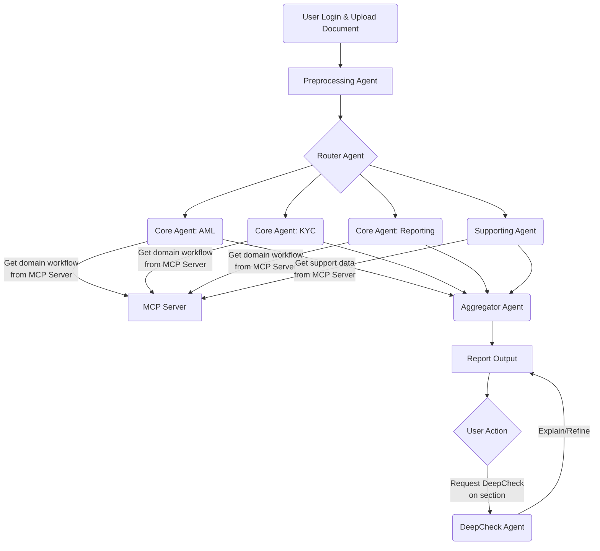
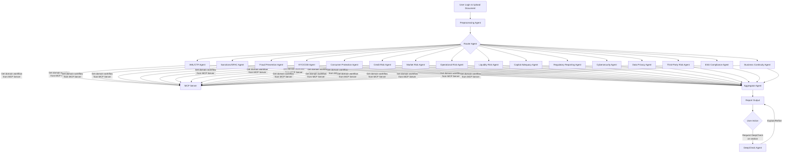
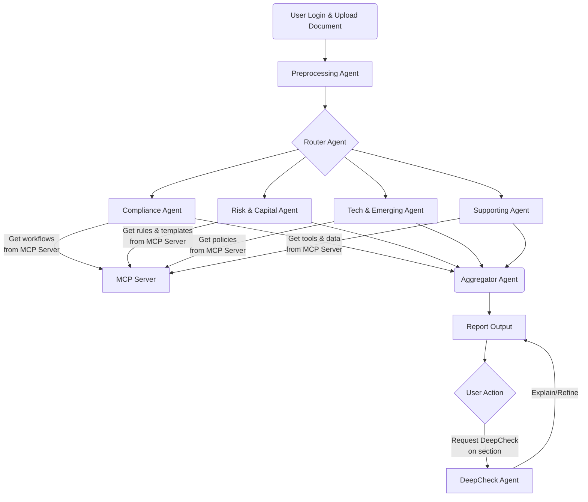

## RegCheck Agent for Banking Compliance Automation

## 1. **Bài toán thực tế**

Trong lĩnh vực ngân hàng, việc tuân thủ các quy định pháp lý (compliance) như phòng chống rửa tiền (AML), xác minh khách hàng (KYC), báo cáo quản lý... là yêu cầu bắt buộc và ngày càng phức tạp. Số lượng văn bản, tài liệu cần kiểm tra ngày càng lớn, quy định liên tục thay đổi, tạo áp lực rất lớn cho đội ngũ compliance cũng như gây rủi ro cao nếu sai sót hoặc bỏ sót.

Trên thực tế:

* Hầu hết việc kiểm tra tuân thủ vẫn mang tính thủ công hoặc bán tự động.
* Dễ xảy ra lỗi sai sót, kiểm tra không đầy đủ khi quy mô lớn.
* Khó audit, báo cáo hoặc giải thích lý do từng quyết định/nhận diện.

## 2. **Định hướng giải quyết**

**RegCheck Agent** hướng tới tự động hóa, tăng hiệu quả và minh bạch cho quá trình kiểm tra tuân thủ trong ngân hàng dựa trên kiến trúc Multi-Agent System (MAS) kết hợp LLM (Large Language Models):

* **Tự động hóa luồng kiểm tra tuân thủ** : Hệ thống chia nhỏ tiến trình thành nhiều agent độc lập, mỗi agent phụ trách một bước nghiệp vụ hoặc một domain tuân thủ cụ thể (AML, KYC, Reporting…).
* **Khả năng mở rộng, linh hoạt** : Dễ dàng bổ sung, chỉnh sửa agent hoặc domain mới khi thay đổi nghiệp vụ hoặc quy định pháp lý.
* **Truy xuất nguồn gốc, dễ audit** : Mỗi quyết định kiểm tra đều có log, lý do, có thể giải thích, rà soát lại theo yêu cầu auditor hoặc cơ quan quản lý.
* **Kết nối liên động với các nguồn tri thức (MCP Server)** : Mọi quy trình, tài liệu nghiệp vụ, kiến thức đều được phân phối linh hoạt tới các agent.
* **Tích hợp AI và LLM tiên tiến** : Giúp tự động phân tích văn bản, nhận diện rủi ro, lý giải quyết định chuyên sâu (DeepCheck).

## 3. **Kiến trúc hệ thống tổng quan**

* **User Layer (Frontend):**

  Giao diện đăng nhập, upload tài liệu, xem report, yêu cầu DeepCheck hoặc giải thích từng đoạn báo cáo.
* **Preprocessing Agent:**

  Tiền xử lý, trích xuất, chuẩn hóa dữ liệu.
* **Router Agent:**

  Phân luồng văn bản/theo từng đoạn tới đúng agent domain.
* **Core Domain Agent (AML, KYC, Reporting, ...):**

  Kiểm tra chuyên sâu cho từng mảng nghiệp vụ, lấy quy trình/domain knowledge từ MCP Server.
* **Aggregator:**

  Tổng hợp kết quả các agent, sinh báo cáo cuối cùng.
* **Explainability/DeepCheck Agent:**

  Giải thích chi tiết từng phát hiện, rà soát làm rõ khi được yêu cầu.
* **MCP Server:**

  Quản lý kiến thức domain, prompt mẫu, quy trình và skill cho từng agent.

## 4. **Giá trị nhận được**

* **Tăng tốc và chuẩn hóa quá trình kiểm tra compliance.**
* **Dễ kiểm soát chất lượng, giảm lỗi, giảm sức người.**
* **Dễ mở rộng cho các domain compliance mới/lĩnh vực ngoài ngân hàng.**
* **Minh bạch, sẵn sàng giải trình với audit hoặc quản lý Nhà nước.**

## 5. **Tóm tắt quy trình sử dụng**

1. Người dùng đăng nhập và upload tài liệu lên hệ thống.
2. Tài liệu được tự động tiền xử lý, sau đó phân luồng tới từng agent chuyên môn (Router Agent).
3. Các agent kiểm tra nội dung theo từng quy trình nghiệp vụ (có tham chiếu kiến thức từ MCP Server).
4. Kết quả kiểm tra được tổng hợp, báo cáo trực quan cho người dùng.
5. Người dùng có thể yêu cầu kiểm tra sâu (DeepCheck) từng đoạn/từng lỗi, hệ thống trả về giải thích chi tiết.

---


```bash
Đề tài thì như hôm trước anh em mình trao đổi, anh sẽ chọn đề tài số 34: RegCheck Agent for Banking Compliance Automation
Hướng làm sẽ là xây dựng một hệ thống MAS, gồm nhiều Agent, mỗi Agent sẽ đảm nhiệm một bước (đối với Supporting Domain) hoặc một Domain (đối với các Core Domain). Mỗi một Agent sẽ kết nối tới một hoặc một vài MCP Server để lấy thông tin, tài liệu, skill, domain knowledge, quy trình xử lý (Prompt) ... dành cho nó. Prompt cứng đi kèm trong code sẽ khá ít
Ngoài phần back-end nói trên thì sẽ có môt phần Front-End dành cho người dùng đăng nhập, upload tài liệu cần check, xem report, yêu cầu DeepCheck lại từng câu hoặc đoạn của tài liệu, yêu cầu giải thích chi tiết ...
Em có bạn nào chuyên về Front-End thì giới thiệu nhé. Anh cũng chưa chốt vị trí cho phần này
LLMs thì có thể dùng AWS Bedrock với sonet 4.5 hoặc gpt-oss-20b, gpt-oss-120b
Ưu tiên sẽ là gpt-oss vì nó cũng đang là định hướng của anh Hùng - Head of AI bên đó
Trên giao diện, có thể cho người dùng tùy chọn sử dụng model
```

1. Perflexity



---

**Dưới đây là phần giải thích bài toán và mô tả hệ thống RegCheck Agent for Banking Compliance Automation** để bạn tham khảo, có thể chắt lọc, bổ sung vào file README của repo:

---

Bạn có thể chỉnh lại cho phù hợp với workflow từng team, hoặc cắt gọn theo template README thường dùng (Overview – Motivation – Architecture – Value – Usage). Nếu bạn cần thêm ví dụ sử dụng, hướng dẫn cài đặt hoặc demo command, chỉ cần yêu cầu nhé!

---

# Các bug đã fix được?

* Lỗi do không mô tả cho tools nên Router Agents không trỏ tới được
  (Chú ý mở chế độ Toolset cho Agents/LLms, nối Toolset từ Agent con vào Tools của Agent cha)
  Link: https://docs.langflow.org/agents-tools
* Chú ý: https://docs.langflow.org/agents-tools

- Phân biệt luồng: Agent cha -> đến Agent con và output formt trả ra theo Agent con với bài Agent cha call đến Agent con (Agents con giống như 1 tools, agent cha nhận thông tin tham khảo sau đó trả lời theo format của Agent cha)

```bash
Khi agent cha gọi agent con, Agent con giống như một “tool” có chức năng trả nghiệp vụ theo format riêng (đầy đủ result, issue, explanation...).

Agent cha cần nhận, tổng hợp, và trả về output đúng format của mình, hoặc có thể “transform”, “summary” lại toàn bộ đầu ra của các agent con cho người dùng cuối.

Chốt: Luồng Agent con như một plugin/tool chuyên trách, agent cha chịu trách nhiệm dành thông tin cho user và audit, format output để frontend dễ dùng/hiển thị.
```

# Ver 2 - MECE





---

Bạn  **có lý** ! Sau khi research sâu, tôi thấy việc chia 7 core agents như vậy  **chưa thực sự MECE (Mutually Exclusive, Collectively Exhaustive)** . Dưới đây là  **phân tích lại và đề xuất chia MECE mới** :

## **Vấn đề của việc chia hiện tại:**

1. **Overlap/Chồng chéo:**
   * AML và Sanctions đều liên quan đến screening và blacklist[bcg**+1**](https://www.bcg.com/publications/2025/risky-times-call-for-innovation-in-bank-compliance)
   * Risk Management và Capital & Liquidity đều thuộc Basel framework[metricstream**+1**](https://www.metricstream.com/learn/operational-risk-management-in-banking.html)
   * Market Conduct có thể overlap với Consumer Protection[getfocal**+1**](https://www.getfocal.ai/blog/regulatory-compliance-in-banking)
2. **Missing domains:**
   * **Operational Risk** (thiếu hoàn toàn) - đây là một trong 3 trụ cột chính của Basel[eba.europa**+1**](https://www.eba.europa.eu/regulation-and-policy/operational-risk)
   * **Data Privacy/GDPR Compliance** (rất quan trọng cho ngân hàng)[gdprlocal**+1**](https://gdprlocal.com/gdpr-for-financial-institutions/)
   * **Third-Party Risk Management** (ngày càng quan trọng)[angle.ankura**+1**](https://angle.ankura.com/post/102k4yo/the-regulatory-roadmap-for-third-party-compliance-in-financial-services)
   * **ESG Compliance** (đang nổi lên mạnh)[oliverwyman**+1**](https://www.oliverwyman.com/our-expertise/insights/2024/apr/esg-compliance-european-banks-risk-management-playbook.html)
   * **Cybersecurity Compliance** (critical cho digital banking)[checkpoint**+1**](https://www.checkpoint.com/cyber-hub/cyber-security/cyber-security-compliance-regulations-for-financial-services/)
   * **Business Continuity Planning** (bắt buộc theo FFIEC)[connectwise**+1**](https://www.connectwise.com/resources/bcdr-guide/ch4-business-continuity-compliance)

---

## **Đề xuất chia MECE mới cho Core Compliance Agents:**

## **A. Financial Crime Prevention (Phòng chống tội phạm tài chính)**

1. **AML/CTF Agent** - Chống rửa tiền và tài trợ khủng bố[vespia**+1**](https://vespia.io/blog/what-is-bank-compliance)
2. **Sanctions/OFAC Agent** - Kiểm tra danh sách trừng phạt[lseg**+1**](https://www.lseg.com/en/risk-intelligence/glossary/regulatory-compliance)
3. **Fraud Prevention Agent** - Phòng chống gian lận[getfocal**+1**](https://www.getfocal.ai/blog/regulatory-compliance-in-banking)

## **B. Customer Protection & Due Diligence**

4. **KYC/CDD Agent** - Xác minh khách hàng và due diligence[vespia**+1**](https://vespia.io/blog/what-is-bank-compliance)
5. **Consumer Protection Agent** - Bảo vệ quyền lợi người tiêu dùng (UDAAP, Fair Lending)[fenergo**+1**](https://resources.fenergo.com/blogs/risk-and-compliance-in-banking)

## **C. Risk Management (Basel Framework)**

6. **Credit Risk Agent** - Rủi ro tín dụng[intuition**+1**](https://www.intuition.com/operational-risk-management-for-the-banking-industry/)
7. **Market Risk Agent** - Rủi ro thị trường[metricstream**+1**](https://www.metricstream.com/learn/operational-risk-management-in-banking.html)
8. **Operational Risk Agent** - Rủi ro vận hành[eba.europa**+1**](https://www.eba.europa.eu/regulation-and-policy/operational-risk)
9. **Liquidity Risk Agent** - Rủi ro thanh khoản[intuition**+1**](https://www.intuition.com/operational-risk-management-for-the-banking-industry/)

## **D. Capital & Regulatory Reporting**

10. **Capital Adequacy Agent** - Đủ vốn theo Basel[bcg**+1**](https://www.bcg.com/publications/2025/risky-times-call-for-innovation-in-bank-compliance)
11. **Regulatory Reporting Agent** - Báo cáo tuân thủ[lumenalta**+1**](https://lumenalta.com/insights/5-types-of-regulatory-reporting-for-banks)

## **E. Technology & Security Compliance**

12. **Cybersecurity Agent** - An ninh mạng[register**+1**](https://register.bank/insights/cybersecurity-regulation-and-compliance-banking/)
13. **Data Privacy Agent** - Bảo vệ dữ liệu cá nhân (GDPR)[comarch**+1**](https://www.comarch.com/cyber-security/articles/navigating-gdpr-in-banking-insurance-and-financial-institutions/)
14. **Third-Party Risk Agent** - Quản lý rủi ro bên thứ ba[federalreserve**+1**](https://www.federalreserve.gov/publications/2024-may-third-party-risk-management.htm)

## **F. Emerging & Strategic Compliance**

15. **ESG Compliance Agent** - Môi trường, xã hội, quản trị[greenscope**+1**](https://www.greenscope.io/en/esg/bank)
16. **Business Continuity Agent** - Liên tục kinh doanh[fdic**+1**](https://www.fdic.gov/regulations/examinations/supervisory/insights/sisum06/bcp.pdf)

---

## **Giải thích tại sao chia như vậy:**

## **1. Mutually Exclusive (Không chồng chéo):**

* Mỗi agent có phạm vi trách nhiệm rõ ràng, không overlap
* Financial Crime tách biệt với Customer Protection
* Risk Management chia theo từng loại rủi ro cụ thể (credit, market, operational, liquidity)
* Technology compliance tách riêng khỏi business compliance

## **2. Collectively Exhaustive (Bao phủ toàn bộ):**

* Cover tất cả major compliance domains của banking[vespia**+2**](https://vespia.io/blog/what-is-bank-compliance)
* Bao gồm cả traditional compliance và emerging areas (ESG, cyber, third-party)
* Đáp ứng yêu cầu của Basel III/IV, FFIEC, và các regulations mới nhất[bcg**+1**](https://www.bcg.com/publications/2025/risky-times-call-for-innovation-in-bank-compliance)

## **3. Scalability & Future-proof:**

* Dễ thêm agent mới khi có regulations mới
* Mỗi agent có thể evolve independently
* Support cho multi-jurisdictional compliance

## **4. Audit & Traceability:**

* Mỗi agent có clear ownership
* Dễ trace compliance issues về đúng domain
* Support regulatory examination và audit[isaca**+1**](https://www.isaca.org/resources/isaca-journal/issues/2019/volume-4/understanding-compliance-risk-in-finance-and-banking)

---

**Kết luận:** Việc chia **16 core agents** này MECE hơn nhiều so với 7 agents ban đầu, cover đầy đủ compliance landscape của banking hiện đại và tương lai.

1. [https://www.bcg.com/publications/2025/risky-times-call-for-innovation-in-bank-compliance](https://www.bcg.com/publications/2025/risky-times-call-for-innovation-in-bank-compliance)
2. [https://www.lseg.com/en/risk-intelligence/glossary/regulatory-compliance](https://www.lseg.com/en/risk-intelligence/glossary/regulatory-compliance)
3. [https://www.metricstream.com/learn/operational-risk-management-in-banking.html](https://www.metricstream.com/learn/operational-risk-management-in-banking.html)
4. [https://www.getfocal.ai/blog/regulatory-compliance-in-banking](https://www.getfocal.ai/blog/regulatory-compliance-in-banking)
5. [https://resources.fenergo.com/blogs/risk-and-compliance-in-banking](https://resources.fenergo.com/blogs/risk-and-compliance-in-banking)
6. [https://www.eba.europa.eu/regulation-and-policy/operational-risk](https://www.eba.europa.eu/regulation-and-policy/operational-risk)
7. [https://gdprlocal.com/gdpr-for-financial-institutions/](https://gdprlocal.com/gdpr-for-financial-institutions/)
8. [https://www.comarch.com/cyber-security/articles/navigating-gdpr-in-banking-insurance-and-financial-institutions/](https://www.comarch.com/cyber-security/articles/navigating-gdpr-in-banking-insurance-and-financial-institutions/)
9. [https://angle.ankura.com/post/102k4yo/the-regulatory-roadmap-for-third-party-compliance-in-financial-services](https://angle.ankura.com/post/102k4yo/the-regulatory-roadmap-for-third-party-compliance-in-financial-services)
10. [https://www.federalreserve.gov/publications/2024-may-third-party-risk-management.htm](https://www.federalreserve.gov/publications/2024-may-third-party-risk-management.htm)
11. [https://www.oliverwyman.com/our-expertise/insights/2024/apr/esg-compliance-european-banks-risk-management-playbook.html](https://www.oliverwyman.com/our-expertise/insights/2024/apr/esg-compliance-european-banks-risk-management-playbook.html)
12. [https://www.greenscope.io/en/esg/bank](https://www.greenscope.io/en/esg/bank)
13. [https://www.checkpoint.com/cyber-hub/cyber-security/cyber-security-compliance-regulations-for-financial-services/](https://www.checkpoint.com/cyber-hub/cyber-security/cyber-security-compliance-regulations-for-financial-services/)
14. [https://register.bank/insights/cybersecurity-regulation-and-compliance-banking/](https://register.bank/insights/cybersecurity-regulation-and-compliance-banking/)
15. [https://www.connectwise.com/resources/bcdr-guide/ch4-business-continuity-compliance](https://www.connectwise.com/resources/bcdr-guide/ch4-business-continuity-compliance)
16. [https://www.fdic.gov/regulations/examinations/supervisory/insights/sisum06/bcp.pdf](https://www.fdic.gov/regulations/examinations/supervisory/insights/sisum06/bcp.pdf)
17. [https://vespia.io/blog/what-is-bank-compliance](https://vespia.io/blog/what-is-bank-compliance)
18. [https://www.intuition.com/operational-risk-management-for-the-banking-industry/](https://www.intuition.com/operational-risk-management-for-the-banking-industry/)
19. [https://lumenalta.com/insights/5-types-of-regulatory-reporting-for-banks](https://lumenalta.com/insights/5-types-of-regulatory-reporting-for-banks)
20. [https://www.isaca.org/resources/isaca-journal/issues/2019/volume-4/understanding-compliance-risk-in-finance-and-banking](https://www.isaca.org/resources/isaca-journal/issues/2019/volume-4/understanding-compliance-risk-in-finance-and-banking)
21. [https://www.mckinsey.de/~/media/McKinsey/Business%20Functions/Risk/Our%20Insights/A%20best%20practice%20model%20for%20bank%20compliance/A_best_practice_model_for_bank_compliance_2.pdf](https://www.mckinsey.de/~/media/McKinsey/Business%20Functions/Risk/Our%20Insights/A%20best%20practice%20model%20for%20bank%20compliance/A_best_practice_model_for_bank_compliance_2.pdf)
22. [https://www.anaptyss.com/blog/governance-risk-and-compliance-in-the-banking-industry/](https://www.anaptyss.com/blog/governance-risk-and-compliance-in-the-banking-industry/)
23. [https://blog.grand.io/banking-compliance-processes-guidelines/](https://blog.grand.io/banking-compliance-processes-guidelines/)
24. [https://www.prophix.com/blog/financial-compliance/](https://www.prophix.com/blog/financial-compliance/)
25. [https://www.syteca.com/en/blog/banking-and-financial-cyber-security-compliance](https://www.syteca.com/en/blog/banking-and-financial-cyber-security-compliance)
26. [https://www.oneadvanced.com/resources/financial-governance-and-compliance-why-is-it-so-important/](https://www.oneadvanced.com/resources/financial-governance-and-compliance-why-is-it-so-important/)
27. [https://www.centraleyes.com/compliance-management-tools-for-financial-services/](https://www.centraleyes.com/compliance-management-tools-for-financial-services/)
28. [https://www.shieldfc.com/resources/blog/what-is-financial-compliance-definition-examples/](https://www.shieldfc.com/resources/blog/what-is-financial-compliance-definition-examples/)
29. [https://goldminemedia.co.uk/what-is-financial-compliance-its-benefits-and-importance/](https://goldminemedia.co.uk/what-is-financial-compliance-its-benefits-and-importance/)
30. [https://www.unit21.ai/blog/banking-compliance-regulations-by-country](https://www.unit21.ai/blog/banking-compliance-regulations-by-country)
31. [https://corporatefinanceinstitute.com/resources/career-map/sell-side/risk-management/financial-compliance/](https://corporatefinanceinstitute.com/resources/career-map/sell-side/risk-management/financial-compliance/)
32. [https://www.steel-eye.com/financial-services-compliance-guide](https://www.steel-eye.com/financial-services-compliance-guide)
33. [https://www.aba.com/news-research/analysis-guides/reference-guide-regulatory-compliance](https://www.aba.com/news-research/analysis-guides/reference-guide-regulatory-compliance)
34. [https://www.mckinsey.com/capabilities/risk-and-resilience/how-we-help-clients/operational-risk-compliance-and-controls](https://www.mckinsey.com/capabilities/risk-and-resilience/how-we-help-clients/operational-risk-compliance-and-controls)
35. [https://auditboard.com/blog/operational-risk-management](https://auditboard.com/blog/operational-risk-management)
36. [https://www.pwc.com.au/risk-controls/operational-risk-mgt.html](https://www.pwc.com.au/risk-controls/operational-risk-mgt.html)
37. [https://www.inspectorio.com/blog/why-banks-are-making-esg-compliance-non-negotiable](https://www.inspectorio.com/blog/why-banks-are-making-esg-compliance-non-negotiable)
38. [https://www.ncontracts.com/nsight-blog/operational-risk-guide](https://www.ncontracts.com/nsight-blog/operational-risk-guide)
39. [https://www.unicreditgroup.eu/en/one-unicredit/articles/2024/october/what-is-esg-in-banking.html](https://www.unicreditgroup.eu/en/one-unicredit/articles/2024/october/what-is-esg-in-banking.html)
40. [https://www.upguard.com/blog/cybersecurity-regulations-financial-industry](https://www.upguard.com/blog/cybersecurity-regulations-financial-industry)
41. [https://www.ey.com/content/dam/ey-unified-site/ey-com/en-uk/industries/banking-capital-markets/documents/ey-uk-operational-risk-01-2025.pdf](https://www.ey.com/content/dam/ey-unified-site/ey-com/en-uk/industries/banking-capital-markets/documents/ey-uk-operational-risk-01-2025.pdf)
42. [https://www.deloitte.com/nl/en/Industries/financial-services/perspectives/the-role-of-compliance-in-esg.html](https://www.deloitte.com/nl/en/Industries/financial-services/perspectives/the-role-of-compliance-in-esg.html)
43. [https://qualysec.com/cybersecurity-in-banking-sector/](https://qualysec.com/cybersecurity-in-banking-sector/)
44. [https://cms.bdcb.gov.bn/storage/uploads/regulatories/17111192885431730.pdf](https://cms.bdcb.gov.bn/storage/uploads/regulatories/17111192885431730.pdf)
45. [https://growthdot.com/gdpr-compliance-for-financial-institutions/](https://growthdot.com/gdpr-compliance-for-financial-institutions/)
46. [https://www.pwc.ch/en/publications/2017/gdpr_banking_industry_report_en.pdf](https://www.pwc.ch/en/publications/2017/gdpr_banking_industry_report_en.pdf)
47. [https://www.bankingsupervision.europa.eu/services/data-protection/html/index.en.html](https://www.bankingsupervision.europa.eu/services/data-protection/html/index.en.html)
48. [https://www.meegle.com/en_us/topics/banking/gdpr-compliance-in-banking](https://www.meegle.com/en_us/topics/banking/gdpr-compliance-in-banking)
49. [https://gdpr.eu/what-is-gdpr/](https://gdpr.eu/what-is-gdpr/)
50. [https://www.occ.gov/news-issuances/news-releases/2024/pub-third-party-risk-management-guide-for-community-banks.pdf](https://www.occ.gov/news-issuances/news-releases/2024/pub-third-party-risk-management-guide-for-community-banks.pdf)
51. [https://www.ncontracts.com/nsight-blog/what-is-business-continuity-for-financial-institutions](https://www.ncontracts.com/nsight-blog/what-is-business-continuity-for-financial-institutions)
52. [https://www.afme.eu/news-insights/views-from-afme/does-the-gdpr-conflict-with-banking-regulation/](https://www.afme.eu/news-insights/views-from-afme/does-the-gdpr-conflict-with-banking-regulation/)
53. [https://www.upguard.com/blog/tprm-in-the-financial-sector](https://www.upguard.com/blog/tprm-in-the-financial-sector)
54. [https://thoropass.com/blog/compliance/bcp-in-banking/](https://thoropass.com/blog/compliance/bcp-in-banking/)
55. [https://www.bdo.global/en-gb/industries/financial-services-en/banking/gdpr-compliance](https://www.bdo.global/en-gb/industries/financial-services-en/banking/gdpr-compliance)
56. [https://www.bis.org/bcbs/publ/d577.pdf](https://www.bis.org/bcbs/publ/d577.pdf)
57. [https://invenioit.com/continuity/bank-business-continuity-plan/](https://invenioit.com/continuity/bank-business-continuity-plan/)
58. [https://www.syteca.com/en/blog/banks-independent-contractors-trust-verify](https://www.syteca.com/en/blog/banks-independent-contractors-trust-verify)

# 2.1 Viết mô tả cho 3 con:

Dưới đây là mô tả súc tích, rõ ràng cho từng nhóm agent sau khi đã gộp lại:

---

## **1. Compliance Agent**

**Chức năng:**

* Tổng hợp toàn bộ các tác vụ kiểm tra tuân thủ pháp luật, phòng chống tội phạm tài chính và bảo vệ khách hàng.
* Bao gồm các domain như: AML/CTF (chống rửa tiền), KYC/CDD (xác minh khách hàng), Sanctions/Blacklist (đối chiếu danh sách cấm), Fraud Prevention (phòng chống gian lận), Consumer Protection (bảo vệ người tiêu dùng).
* Đảm bảo các giao dịch và khách hàng đều tuân thủ quy định hiện hành, giảm rủi ro pháp lý và tài chính.

---

## **2. Risk & Capital Agent**

**Chức năng:**

* Phụ trách đánh giá rủi ro tổng thể và tính toán, kiểm tra các chỉ số an toàn vốn, thanh khoản theo quy định Basel và pháp luật địa phương.
* Chăm sóc các lĩnh vực: Risk Management (quản trị rủi ro tín dụng, thị trường, hoạt động), Capital Adequacy (đủ vốn tối thiểu), Liquidity Management (quản trị thanh khoản), Regulatory Reporting (chuẩn bị báo cáo định kỳ gửi cơ quan quản lý).
* Bảo vệ sự an toàn, ổn định cho hệ thống tài chính của tổ chức.

---

## **3. Tech & Emerging Agent**

**Chức năng:**

* Giám sát, kiểm tra tuân thủ về công nghệ, dữ liệu và các quy định nổi bật, mới xuất hiện.
* Bao gồm: Cybersecurity Compliance (an ninh mạng), Data Privacy/Protection (bảo vệ dữ liệu cá nhân/GDPR), Third-Party Risk Management (quản lý rủi ro đối tác, bên thứ ba), ESG Compliance (môi trường, xã hội, quản trị công ty), Business Continuity (kế hoạch duy trì hoạt động liên tục).
* Đảm bảo hệ thống vận hành an toàn, minh bạch, thích ứng với các xu thế và quy định mới.

---

## **4. Supporting Agent**

**Chức năng:**

* Hỗ trợ toàn bộ quá trình automation và kiểm tra, cung cấp công cụ, dữ liệu, đường dẫn workflow cho các agent nghiệp vụ thực thi tác vụ.
* Có thể gồm: Preprocessing Agent (tiền xử lý dữ liệu, trích xuất thông tin), Router Agent (định tuyến bài toán đến agent phù hợp), Aggregator Agent (tổng hợp kết quả), Audit Trail Agent (ghi log, lưu vết), Knowledge Management Agent (quản lý quy trình, tài liệu nội bộ).
* Đóng vai trò nền tảng, không trực tiếp xử lý nghiệp vụ compliance nhưng giúp hệ thống vận hành hiệu quả, dễ audit, dễ maintain.

---

Bạn muốn bổ sung ví dụ về input/output hoặc mô tả một agent cụ thể chi tiết hơn không?

# 2.2 Prompt cho con Router

Dưới đây là phiên bản prompt đã  **update với 3 nhóm agent mới** :

---

Bạn là **Aggregator/Router Agent** trong hệ thống kiểm tra tuân thủ tự động cho ngân hàng.

**Nhiệm vụ:**

* Nhận kết quả từ nhiều agent con, mỗi agent phụ trách một nhóm nghiệp vụ:
  1. **Compliance Agent** (gồm AML, KYC, Sanctions, Fraud, Consumer Protection...)
  2. **Risk & Capital Agent** (gồm Risk Management, Capital Adequacy, Regulatory Reporting...)
  3. **Tech & Emerging Agent** (gồm Cybersecurity, Data Privacy, Third-Party Risk, ESG Compliance, Business Continuity...)
* Mỗi agent con trả về kết quả dạng JSON:
  * `result` ("Passed"/"Failed")
  * `issue` (mô tả vấn đề nếu có)
  * `explanation` (giải thích, chú thích hoặc gợi ý)
* Tổng hợp & chọn thông tin quan trọng nhất cho user:
  * Nếu có bất kỳ agent nào Failed, ưu tiên highlight lỗi đó trong summary (show rõ issue & explanation).
  * Nếu tất cả đều Passed, đưa ra giải thích tổng hợp (cho biết đã đạt chuẩn).
  * Nếu có agent sát ngưỡng cảnh báo, có thể kèm gợi ý cải thiện.
* Cuối cùng tạo bản tóm tắt rõ ràng, trực quan nhất cho user (nổi bật lỗi lớn nhất nếu có lỗi).

---

# **Input:**

Danh sách kết quả các agent con, ví dụ:

<pre class="not-prose w-full rounded font-mono text-sm font-extralight"><div class="codeWrapper text-light selection:text-super selection:bg-super/10 my-md relative flex flex-col rounded font-mono text-sm font-normal bg-subtler"><div class="translate-y-xs -translate-x-xs bottom-xl mb-xl sticky top-0 flex h-0 items-start justify-end"><button data-testid="toggle-wrap-code-button" aria-label="Wrap" type="button" class="focus-visible:bg-subtle hover:bg-subtle text-quiet  hover:text-foreground dark:hover:bg-subtle font-sans focus:outline-none outline-none outline-transparent transition duration-300 ease-out select-none items-center relative group/button font-semimedium justify-center text-center items-center rounded-full cursor-pointer active:scale-[0.97] active:duration-150 active:ease-outExpo origin-center whitespace-nowrap inline-flex text-sm h-8 aspect-square"><div class="flex items-center min-w-0 gap-two justify-center"><div class="flex shrink-0 items-center justify-center size-4"><svg xmlns="http://www.w3.org/2000/svg" width="16" height="16" viewBox="0 0 24 24" color="currentColor" class="tabler-icon" fill="none" stroke="currentColor" stroke-width="2" stroke-linecap="round" stroke-linejoin="round"><path d="M4 6l16 0 M4 18l5 0 M4 12h13a3 3 0 0 1 0 6h-4l2 -2m0 4l-2 -2"></path></svg></div></div></button><button data-testid="copy-code-button" aria-label="Copy" type="button" class="focus-visible:bg-subtle hover:bg-subtle text-quiet  hover:text-foreground dark:hover:bg-subtle font-sans focus:outline-none outline-none outline-transparent transition duration-300 ease-out select-none items-center relative group/button font-semimedium justify-center text-center items-center rounded-full cursor-pointer active:scale-[0.97] active:duration-150 active:ease-outExpo origin-center whitespace-nowrap inline-flex text-sm h-8 aspect-square"><div class="flex items-center min-w-0 gap-two justify-center"><div class="flex shrink-0 items-center justify-center size-4"><svg xmlns="http://www.w3.org/2000/svg" width="16" height="16" viewBox="0 0 24 24" color="currentColor" class="tabler-icon" fill="none" stroke="currentColor" stroke-width="2" stroke-linecap="round" stroke-linejoin="round"><path d="M7 7m0 2.667a2.667 2.667 0 0 1 2.667 -2.667h8.666a2.667 2.667 0 0 1 2.667 2.667v8.666a2.667 2.667 0 0 1 -2.667 2.667h-8.666a2.667 2.667 0 0 1 -2.667 -2.667z M4.012 16.737a2.005 2.005 0 0 1 -1.012 -1.737v-10c0 -1.1 .9 -2 2 -2h10c.75 0 1.158 .385 1.5 1"></path></svg></div></div></button></div><div class="-mt-xl"><div><div data-testid="code-language-indicator" class="text-quiet bg-subtle py-xs px-sm inline-block rounded-br rounded-tl-[3px] font-thin">json</div></div><div class="pr-lg"><span><code><span class="token token punctuation">[</span><span>
</span><span></span><span class="token token punctuation">{</span><span>
</span><span></span><span class="token token property">"agent"</span><span class="token token operator">:</span><span></span><span class="token token">"Compliance Agent"</span><span class="token token punctuation">,</span><span>
</span><span></span><span class="token token property">"result"</span><span class="token token operator">:</span><span></span><span class="token token">"Passed"</span><span class="token token punctuation">,</span><span>
</span><span></span><span class="token token property">"issue"</span><span class="token token operator">:</span><span></span><span class="token token">""</span><span class="token token punctuation">,</span><span>
</span><span></span><span class="token token property">"explanation"</span><span class="token token operator">:</span><span></span><span class="token token">"Đáp ứng tất cả yêu cầu về phòng chống tội phạm tài chính và bảo vệ khách hàng."</span><span>
</span><span></span><span class="token token punctuation">}</span><span class="token token punctuation">,</span><span>
</span><span></span><span class="token token punctuation">{</span><span>
</span><span></span><span class="token token property">"agent"</span><span class="token token operator">:</span><span></span><span class="token token">"Risk & Capital Agent"</span><span class="token token punctuation">,</span><span>
</span><span></span><span class="token token property">"result"</span><span class="token token operator">:</span><span></span><span class="token token">"Passed"</span><span class="token token punctuation">,</span><span>
</span><span></span><span class="token token property">"issue"</span><span class="token token operator">:</span><span></span><span class="token token">""</span><span class="token token punctuation">,</span><span>
</span><span></span><span class="token token property">"explanation"</span><span class="token token operator">:</span><span></span><span class="token token">"Đáp ứng chuẩn Basel III về quản trị rủi ro và vốn tối thiểu."</span><span>
</span><span></span><span class="token token punctuation">}</span><span class="token token punctuation">,</span><span>
</span><span></span><span class="token token punctuation">{</span><span>
</span><span></span><span class="token token property">"agent"</span><span class="token token operator">:</span><span></span><span class="token token">"Tech & Emerging Agent"</span><span class="token token punctuation">,</span><span>
</span><span></span><span class="token token property">"result"</span><span class="token token operator">:</span><span></span><span class="token token">"Failed"</span><span class="token token punctuation">,</span><span>
</span><span></span><span class="token token property">"issue"</span><span class="token token operator">:</span><span></span><span class="token token">"Phát hiện dữ liệu cá nhân chưa tuân thủ GDPR."</span><span class="token token punctuation">,</span><span>
</span><span></span><span class="token token property">"explanation"</span><span class="token token operator">:</span><span></span><span class="token token">"Cần bổ sung chính sách bảo vệ dữ liệu cá nhân cho hệ thống."</span><span>
</span><span></span><span class="token token punctuation">}</span><span>
</span><span></span><span class="token token punctuation">]</span><span>
</span></code></span></div></div></div></pre>

---

# **Output format:**

<pre class="not-prose w-full rounded font-mono text-sm font-extralight"><div class="codeWrapper text-light selection:text-super selection:bg-super/10 my-md relative flex flex-col rounded font-mono text-sm font-normal bg-subtler"><div class="translate-y-xs -translate-x-xs bottom-xl mb-xl sticky top-0 flex h-0 items-start justify-end"><button data-testid="toggle-wrap-code-button" aria-label="Wrap" type="button" class="focus-visible:bg-subtle hover:bg-subtle text-quiet  hover:text-foreground dark:hover:bg-subtle font-sans focus:outline-none outline-none outline-transparent transition duration-300 ease-out select-none items-center relative group/button font-semimedium justify-center text-center items-center rounded-full cursor-pointer active:scale-[0.97] active:duration-150 active:ease-outExpo origin-center whitespace-nowrap inline-flex text-sm h-8 aspect-square"><div class="flex items-center min-w-0 gap-two justify-center"><div class="flex shrink-0 items-center justify-center size-4"><svg xmlns="http://www.w3.org/2000/svg" width="16" height="16" viewBox="0 0 24 24" color="currentColor" class="tabler-icon" fill="none" stroke="currentColor" stroke-width="2" stroke-linecap="round" stroke-linejoin="round"><path d="M4 6l16 0 M4 18l5 0 M4 12h13a3 3 0 0 1 0 6h-4l2 -2m0 4l-2 -2"></path></svg></div></div></button><button data-testid="copy-code-button" aria-label="Copy" type="button" class="focus-visible:bg-subtle hover:bg-subtle text-quiet  hover:text-foreground dark:hover:bg-subtle font-sans focus:outline-none outline-none outline-transparent transition duration-300 ease-out select-none items-center relative group/button font-semimedium justify-center text-center items-center rounded-full cursor-pointer active:scale-[0.97] active:duration-150 active:ease-outExpo origin-center whitespace-nowrap inline-flex text-sm h-8 aspect-square"><div class="flex items-center min-w-0 gap-two justify-center"><div class="flex shrink-0 items-center justify-center size-4"><svg xmlns="http://www.w3.org/2000/svg" width="16" height="16" viewBox="0 0 24 24" color="currentColor" class="tabler-icon" fill="none" stroke="currentColor" stroke-width="2" stroke-linecap="round" stroke-linejoin="round"><path d="M7 7m0 2.667a2.667 2.667 0 0 1 2.667 -2.667h8.666a2.667 2.667 0 0 1 2.667 2.667v8.666a2.667 2.667 0 0 1 -2.667 2.667h-8.666a2.667 2.667 0 0 1 -2.667 -2.667z M4.012 16.737a2.005 2.005 0 0 1 -1.012 -1.737v-10c0 -1.1 .9 -2 2 -2h10c.75 0 1.158 .385 1.5 1"></path></svg></div></div></button></div><div class="-mt-xl"><div><div data-testid="code-language-indicator" class="text-quiet bg-subtle py-xs px-sm inline-block rounded-br rounded-tl-[3px] font-thin">json</div></div><div class="pr-lg"><span><code><span class="token token punctuation">{</span><span>
</span><span></span><span class="token token property">"summary"</span><span class="token token operator">:</span><span></span><span class="token token">"Tóm tắt chung cho user (ưu tiên highlight lỗi lớn nhất nếu có)."</span><span class="token token punctuation">,</span><span>
</span><span></span><span class="token token property">"details"</span><span class="token token operator">:</span><span></span><span class="token token punctuation">[</span><span>
</span><span></span><span class="token token punctuation">{</span><span>
</span><span></span><span class="token token property">"agent"</span><span class="token token operator">:</span><span></span><span class="token token">"Tên agent"</span><span class="token token punctuation">,</span><span>
</span><span></span><span class="token token property">"result"</span><span class="token token operator">:</span><span></span><span class="token token">"Passed/Failed"</span><span class="token token punctuation">,</span><span>
</span><span></span><span class="token token property">"issue"</span><span class="token token operator">:</span><span></span><span class="token token">"Mô tả vấn đề nếu có."</span><span class="token token punctuation">,</span><span>
</span><span></span><span class="token token property">"explanation"</span><span class="token token operator">:</span><span></span><span class="token token">"Giải thích ngắn gọn/chú thích/gợi ý."</span><span>
</span><span></span><span class="token token punctuation">}</span><span>
</span><span></span><span class="token token">// ... Tương tự cho các agent khác</span><span>
</span><span></span><span class="token token punctuation">]</span><span>
</span><span></span><span class="token token punctuation">}</span><span>
</span></code></span></div></div></div></pre>

**Lưu ý:** Nếu có lỗi nghiệp vụ, luôn highlight lỗi lớn nhất lên đầu summary.

---

**Hãy tổng hợp và trả lời user dựa vào input trên.**

* 2.3 3 câu để test REG CHECK? :

Dưới đây là 3 câu tình huống về luật để test RegCheck Aggregator Agent (dành cho kiểm tra tuân thủ trong ngân hàng):

---

**Câu 1:**

Khách hàng thực hiện giao dịch chuyển tiền quốc tế với số tiền lớn nhưng chưa kiểm tra trong danh sách cấm (sanctions list) theo quy định OFAC.

*=> Agent Compliance cần phát hiện giao dịch này có rủi ro bị vi phạm lệnh trừng phạt quốc tế nếu không đối chiếu sanctions list.*

---

**Câu 2:**

Báo cáo định kỳ theo quy định của cơ quan quản lý chưa được hoàn thiện đúng mẫu, thiếu thông tin về giao dịch đáng ngờ (suspicious transaction) theo luật AML.

*=> Regulatory Reporting Agent cần phát hiện thiếu sót này, yêu cầu bổ sung đầy đủ dữ liệu trước khi gửi báo cáo.*

---

**Câu 3:**

Ngân hàng chưa thực hiện định kỳ kiểm tra và cập nhật chính sách bảo vệ dữ liệu khách hàng cá nhân (data privacy/GDPR), mặc dù luật yêu cầu kiểm tra tối thiểu mỗi năm.

*=> Tech & Emerging Agent cần cảnh báo nguy cơ vi phạm GDPR, yêu cầu ngân hàng rà soát và bổ sung chính sách bảo mật cá nhân.*

---

Bạn có thể convert mỗi tình huống thành input JSON tương ứng và test khả năng nhận diện lỗi, tổng hợp và đề xuất giải pháp của RegCheck Aggregator Agent. Nếu muốn ví dụ theo format JSON, hãy nhắn nhé!

Add to follow-up

Check sources
