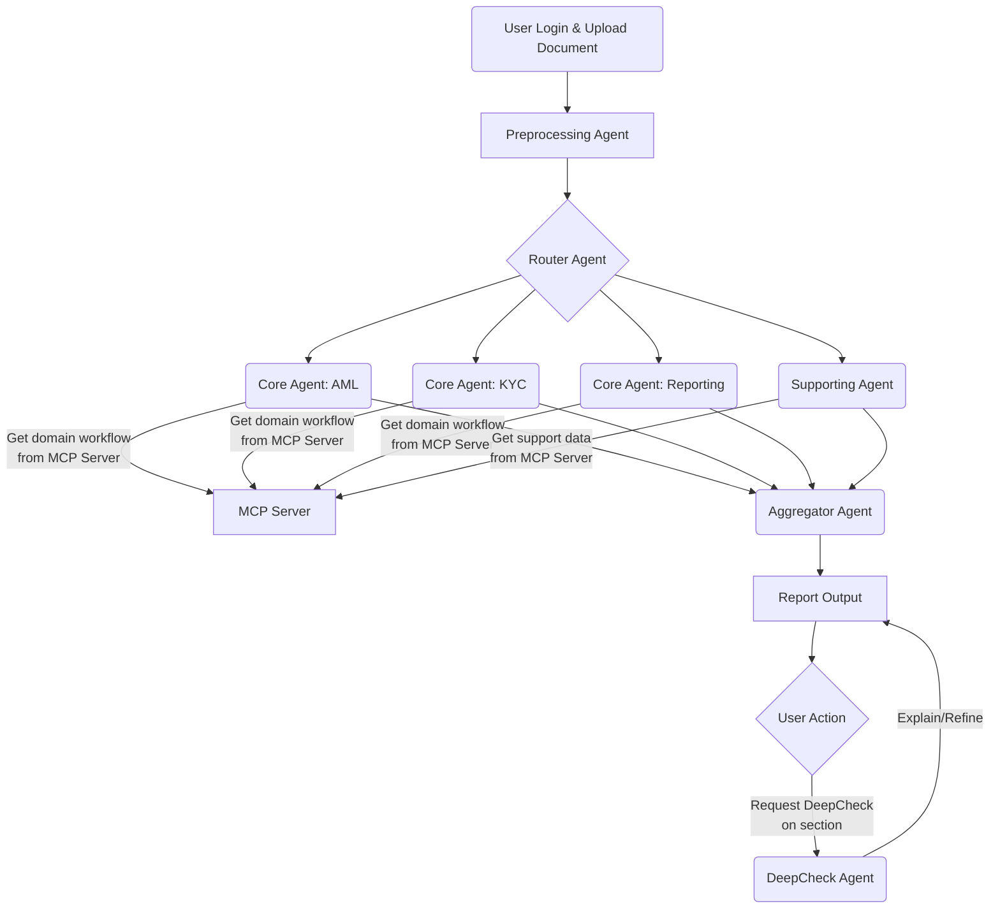

1. Perflexity

```mermaid
flowchart TD
    A(User Login & Upload Document) --> B[Preprocessing Agent]
    B --> C{Router Agent}
    C --> D1(Core Agent: AML)
    C --> D2(Core Agent: KYC)
    C --> D3(Core Agent: Reporting)
    C --> D4(Supporting Agent)
    D1 -- "Get domain workflow\nfrom MCP Server" --> E1[MCP Server]
    D2 -- "Get domain workflow\nfrom MCP Server" --> E1
    D3 -- "Get domain workflow\nfrom MCP Server" --> E1
    D4 -- "Get support data\nfrom MCP Server" --> E1
    D1 --> F(Aggregator Agent)
    D2 --> F
    D3 --> F
    D4 --> F
    F --> G[Report Output]
    G --> H{User Action}
    H -- "Request DeepCheck\non section" --> I(DeepCheck Agent)
    I -- "Explain/Refine" --> G

```
